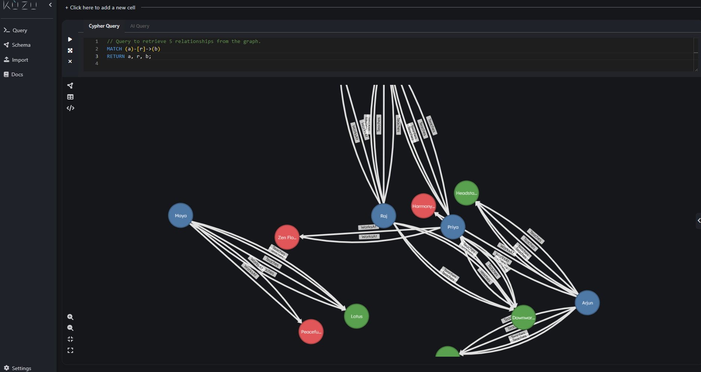

# Agentic Knowledge Graph System using Kuzu

This project demonstrates how to build a complete **agentic knowledge graph system** using **Kuzu**, a powerful lightweight, embeddable graph database that can be integrated directly inside AI systems without the heavyweight operational overhead of enterprise graph engines. 

Its native support for analytical graph workloads, vector features, and embedded deployment make it ideal for building agentic knowledge platforms that can run locally, on edge devices, or inside AI orchestration layers.





## 📋 Project Overview

Kuzu is perfect for:
- **Real-time graph analytics** on embedded AI systems
- **Knowledge representation** for intelligent agents
- **Complex relationship queries** in production environments
- **Lightweight deployment** without infrastructure overhead
- **Integration with AI/ML pipelines** for knowledge-driven decisions

---

### KuzuDB Explorer

You can start the KuzuDB Explorer (provided with Kuzu) to inspect any generated database in a browser at `http://localhost:8000`.

Example 
```bash
kuzudb-explorer --db path/to/yoga.kuzu  
```

## 🚀 Examples Overview

This project provides **5 comprehensive examples** demonstrating different knowledge graph domains:

### 1. **YogaKnowledge** - Health & Wellness Domain
**File:** `YogaKnowledge.java`

A knowledge graph modeling yoga studios, instructors, poses, and teaching relationships.

**Graph Structure:**
- **Nodes:** Instructor, Pose, Studio
- **Relationships:** Teaches (Instructor→Pose), WorksAt (Instructor→Studio)

**Sample Data:**
- 4 yoga instructors (Priya, Arjun, Maya, Raj) with 5-12 years experience
- 5 yoga poses with difficulty levels (1-5)
- 4 yoga studios with capacity (25-50)
- 7 teaching relationships with weekly frequency

**Key Queries (10 Complex Queries):**
1. Basic instructor-pose relationships
2. 3-way relationships (Instructor-Studio-Pose)
3. Filter experienced instructors (>8 years)
4. Identify difficult poses (difficulty ≥4)
5. Instructors teaching advanced poses
6. Studio teaching load analysis
7. Instructors teaching multiple poses
8. Most frequently taught poses
9. Instructors ranked by teaching load
10. Studios ranked by average instructor experience

**CSV Files:**
```
src/main/resources/yoga/
├── instructor.csv          (name, experience_years)
├── pose.csv               (name, difficulty_level)
├── studio.csv             (name, capacity)
├── teaches.csv            (instructor, pose, frequency)
└── works-at.csv           (instructor, studio)
```

---

### 2. **FraudDetection** - Financial Crime Prevention
**File:** `FraudDetection.java`

A knowledge graph for fraud detection systems using detection methods, fraud types, indicators, and data sources.

**Graph Structure:**
- **Nodes:** FraudType, DetectionMethod, Indicator, DataSource
- **Relationships:** Detects (DetectionMethod→FraudType with confidence), Uses (DetectionMethod→Indicator), Analyzes (DetectionMethod→DataSource)

**Sample Data:**
- 5 fraud types (Account Takeover, Identity Theft, Payment Fraud, Application Fraud, Transaction Fraud)
- 7 detection methods (Machine Learning, Rule-Based Systems, Network Analysis, etc.)
- 8 fraud indicators (Unusual Time, Velocity Check, Location Mismatch, etc.)
- 7 data sources (Transaction Data, Account Data, Device Data, Behavioral Data, etc.)
- 15 detection relationships with 75-92% confidence
- 15 indicator usage mappings
- 14 data source analysis mappings

**Key Queries (10 Complex Queries):**
1. Detection methods and fraud types they detect
2. Detection methods and their indicators
3. Complete detection workflows (method→fraud→indicator)
4. Data sources analyzed by methods
5. High-confidence detections (>80%)
6. Fraud types with detection methods coverage
7. Methods ranked by indicator count
8. Complete fraud detection pipeline
9. Indicators reused across methods
10. Data source coverage analysis

**CSV Files:**
```
src/main/resources/fraud/
├── fraud-type.csv
├── detection-method.csv
├── indicator.csv
├── data-source.csv
├── detects.csv              (method, fraud_type, confidence)
├── uses.csv                 (method, indicator)
└── analyzes.csv             (method, data_source)
```

---

### 3. **CycleDetection** - Money Laundering & Transaction Fraud
**File:** `CycleDetection.java`

A graph-based cycle detection system for identifying suspicious circular money flows using DFS algorithm.

**Graph Structure:**
- **Nodes:** Account, Transaction, CyclePattern, Algorithm
- **Relationships:** Transfers (Account→Account with amount), Involves (Transaction→Account), DetectsPattern (Algorithm→CyclePattern)

**Sample Data:**
- 6 accounts with risk scores (0.45-0.92)
- 7 transactions with amounts and timestamps
- 5 cycle patterns (Circular Money Flow, Money Laundering, Credit Card Loop, Identity Theft Loop, Account Takeover Cycle)
- 4 detection algorithms (DFS, Floyd-Warshall, Tarjan's SCC, Bellman-Ford)
- Main cycle detected: Account A → B → C → D → A ($50,000 each transfer)

**Key Features:**
- **DFS-based cycle detection algorithm** with O(V+E) complexity
- Detects cycles of any length
- Risk scoring and classification (🔴 HIGH RISK / 🟡 MONITOR / ✓ SAFE)
- Cycle metrics calculation (length, average risk, total amount)
- Network statistics and anomaly detection

**Key Queries (10 Complex Queries):**
1. All account transfers
2. High-risk accounts (>0.7 risk)
3. 2-step cycles (A→B→A)
4. 3-step cycles (A→B→C→A)
5. 4-step cycles (A→B→C→D→A) - MAIN CYCLE
6. Account transfer summary
7. Cycle patterns and algorithms
8. High-risk cycle analysis
9. Transactions linked to accounts
10. Cycle risk assessment

**CSV Files:**
```
src/main/resources/cycle/
├── account.csv              (account_id, account_type, risk_score)
├── transaction.csv          (transaction_id, amount, timestamp)
├── cycle-pattern.csv        (pattern_id, pattern_name, description, risk_level)
├── algorithm.csv            (algorithm_name, description, time_complexity)
├── transfers.csv            (from, to, transaction_id, amount)
├── involves.csv             (transaction_id, account_id)
└── detects-pattern.csv      (algorithm_name, pattern_id, confidence)
```

**Example Output:**
```
Cycle 1:
  Path: Account A → Account B → Account C → Account D → Account A
  Cycle Length: 4 accounts
  Average Risk Score: 0.86
  Status: 🔴 HIGH RISK - INVESTIGATE
```

---

### 4. **BirdMigration** - Wildlife & Environmental Analysis
**File:** `BirdMigration.java`

A knowledge graph tracking migratory bird species, migration routes, seasonal patterns, and environmental factors.

**Graph Structure:**
- **Nodes:** BirdSpecies, Location, Season, EnvironmentalFactor
- **Relationships:** MigratesFrom (BirdSpecies→Location), MigratesTo (BirdSpecies→Location), ActiveIn (Location→Season), InfluencedBy (BirdSpecies→EnvironmentalFactor)

**Sample Data:**
- 3 migratory bird species:
  - Arctic Tern: 44,000 miles annually (longest animal migration!)
  - Bar-tailed Godwit: 11,000 miles annually
  - Swainson's Hawk: 13,000 miles annually
- 11 locations (breeding grounds, stopovers, wintering grounds)
- 4 seasons with temperature ranges
- 7 environmental factors (Day Length, Food Availability, Temperature, Wind Patterns, Magnetic Navigation, Genetic Programming, Climate Change)

**Key Features:**
- Complete migration cycle detection and analysis
- Migration type classification (Extreme Long-Distance, Long-Distance, Medium-Distance, Short-Distance)
- Migration efficiency analysis (miles/day)
- Health status classification (🟢 OPTIMAL / 🟡 NORMAL / 🔴 SLOW)
- Environmental sensitivity analysis
- Champion migrator identification

**Key Queries (10 Complex Queries):**
1. All bird species and migration distances
2. Spring migration routes (departures)
3. Fall migration routes (arrivals)
4. Long-distance migrants (>8000 miles)
5. Key stopover and breeding locations
6. Environmental factors influencing migration
7. Seasonal activity in locations
8. Complete migration cycles
9. Species most influenced by environmental factors
10. Migration efficiency analysis (distance/duration)

**CSV Files:**
```
src/main/resources/migration/
├── bird-species.csv         (species_name, migration_distance, flight_duration)
├── location.csv             (location_name, location_type, habitat_quality)
├── season.csv               (season_name, month_range, temperature_range)
├── environmental-factor.csv (factor_name, description, impact_level)
├── migrates-from.csv        (species, location, departure_month)
├── migrates-to.csv          (species, location, arrival_month)
├── active-in.csv            (location, season)
└── influenced-by.csv        (species, factor, influence_strength)
```

**Example Output:**
```
✅ 3 ACTIVE MIGRATION CYCLE(S) DETECTED:

Cycle 1: Arctic Tern
━━━━━━━━━━━━━━━━━━━━━━━━━━━━━━━━━━
🔄 Route: Arctic (Breeding) ↔ Antarctic (Wintering)
📏 Distance: 44000 miles annually
⏱️  Duration: 44 days total
📊 Daily Pace: 1000 miles/day
Classification: 🌍 EXTREME LONG-DISTANCE (Trans-Continental)
Status: 🟢 OPTIMAL - Excellent migration efficiency
```

---

### 5. **VishalMysore** - Professional Profile & Knowledge
**File:** `VishalMysore.java`

A comprehensive personal knowledge graph representing professional expertise, skills, experience, locations, and achievements.

**Graph Structure:**
- **Nodes:** Person, Skill, Organization, Location, Achievement
- **Relationships:** HasSkill (Person→Skill with proficiency), WorksFor (Person→Organization), LivesIn (Person→Location), BornIn (Person→Location), Has (Person→Achievement), Located (Organization→Location), RelatedTo (Skill→Skill)

**Sample Data:**
- 1 person: Vishal Mysore (Director, 25 years experience)
- 27 skills across 6 categories with proficiency levels (75-98%):
  - **AI/ML:** AI (95%), Machine Learning (94%), Deep Learning (92%), NLP (88%), Computer Vision (87%), Neural Networks (93%)
  - **Programming:** Python (92%), Java (90%), JavaScript (85%)
  - **Infrastructure:** Cloud Computing (90%), DevOps (88%)
  - **Architecture:** Microservices (89%), APIs (91%)
  - **Data:** Databases (90%), SQL (93%), NoSQL (87%)
  - **Tools:** TensorFlow (91%), PyTorch (90%)
  - **Wellness:** Yoga (80%), Hatha Yoga (78%), Vinyasa (76%), Meditation (82%)
- 1 organization: Citibank (25 years)
- 2 locations: Canada, India
- 4 achievement categories: Patents (10), AI Research (15), Publications (8), Awards (12)
- 25 skill relationship mappings (hierarchy and dependencies)

**Key Features:**
- Comprehensive professional profile analysis
- Skill category aggregation with average proficiency
- Proficiency classification (Expert/Advanced/Intermediate)
- Achievement tracking and recognition
- Geographic and organizational presence
- Skill relationship mapping

**Key Queries (10 Complex Queries):**
1. Person profile summary
2. Skills and proficiency levels
3. Technical skill hierarchy
4. Work experience and organizations
5. Geographic presence and locations
6. Achievements and awards
7. Skills grouped by category
8. Organizations and locations
9. Complete professional profile (aggregated)
10. Skill proficiency analysis with classification

**CSV Files:**
```
src/main/resources/vishal/
├── person.csv               (person_name, description)
├── skill.csv                (skill_name, category, description)
├── organization.csv         (org_name, industry, description)
├── location.csv             (location_name, region, description)
├── achievement.csv          (achievement_name, description)
├── has-skill.csv            (person, skill, proficiency_level)
├── works-for.csv            (person, organization, years_of_service)
├── lives-in.csv             (person, location)
├── born-in.csv              (person, location)
├── has-achievement.csv      (person, achievement, count)
├── located.csv              (organization, location)
└── related-to.csv           (skill1, skill2, relationship_type)
```

**Example Output:**
```
👤 VISHAL MYSORE - PROFESSIONAL PROFILE
======================================================================

📊 KEY METRICS:
  • Total Skills: 27
  • Average Proficiency: 88.3%
  • Years of Experience: 25
  • Organizations: 1
  • Achievements: 45
  • Geographic Presence: 2 locations

🎯 OVERALL ASSESSMENT: ⭐ ADVANCED LEVEL
======================================================================
```

---

## 🏗️ Architecture & Design Patterns

### Knowledge Graph Nodes & Relationships Pattern
Each example follows a consistent pattern:

```
Node Types (Entities):
  └─ Represent domain-specific entities

Relationship Types (Connections):
  ├─ From-To relationships with properties
  ├─ Directed edges for causal/directional relationships
  └─ Properties store context (confidence, strength, duration, etc.)

CSV Structure:
  ├─ Node CSVs: Primary key + attributes
  └─ Relationship CSVs: Source, Target, + relationship properties
```

### Query Patterns

All examples implement **10 Progressive Queries:**
1. **Basic Entity Queries** - Simple node retrieval
2. **Simple Relationships** - Basic edge traversal
3. **Complex Multi-Relationships** - Multiple path matching
4. **Filtering & Aggregation** - WHERE clauses and COUNT/SUM
5. **Ordering & Ranking** - ORDER BY with complex logic
6. **Advanced Analytics** - CASE statements and statistical analysis
7. **Aggregation with Grouping** - WITH clauses and complex aggregations
8. **Multi-step Path Analysis** - 3+ relationship traversals
9. **Relationship Reuse Analysis** - Identifying shared connections
10. **Advanced Statistical Analysis** - Complex metrics and classifications

### Cycle Detection Implementation

**CycleDetection** provides a production-ready **DFS Algorithm:**
```java
Algorithm: Depth-First Search (DFS)
Time Complexity: O(V + E)
Space Complexity: O(V)
Features:
  - Detects cycles of any length
  - Risk scoring and classification
  - Cycle metrics calculation
  - Real-time anomaly detection
```

### Migration Analysis Implementation

**BirdMigration** provides **Complete Lifecycle Analysis:**
```
Detection: Identify all migration cycles
Classification: By distance, duration, efficiency
Analysis: Environmental factor influence
Statistics: Aggregated migration metrics
Status: Health classification and alerts
```

---

## 📊 Query Examples

### Example 1: Simple Relationship Query (YogaKnowledge)
```cypher
MATCH (i:Instructor)-[t:Teaches]->(p:Pose)
RETURN i.name, t.frequency, p.name;
```

### Example 2: Complex Multi-Path Query (VishalMysore)
```cypher
MATCH (p:Person)-[hs:HasSkill]->(s:Skill),
      (s)-[r:RelatedTo]->(related:Skill)
RETURN p.person_name, s.skill_name, r.relationship_type, related.skill_name;
```

### Example 3: Aggregation Query (BirdMigration)
```cypher
MATCH (b:BirdSpecies)-[mf:MigratesFrom]->(origin:Location),
      (b)-[mt:MigratesTo]->(destination:Location)
WITH b, COUNT(mf) as migration_count
RETURN b.species_name, b.migration_distance, migration_count;
```

### Example 4: Cycle Detection Query (CycleDetection)
```cypher
MATCH (a1:Account)-[t1:Transfers]->(a2:Account)-[t2:Transfers]->(a3:Account)-[t3:Transfers]->(a4:Account)-[t4:Transfers]->(a5:Account)
WHERE a1.account_id = a5.account_id
RETURN a1.account_id, a2.account_id, a3.account_id, a4.account_id;
```

---

## 🛠️ How to Run Examples

### Prerequisites
- Java 17+
- Maven 3.8+
- Kuzu database library (included in `pom.xml`)

### Build Project
```bash
mvn clean install
```

### Run Individual Examples

#### YogaKnowledge
```bash
mvn exec:java -Dexec.mainClass="io.github.vishalmysore.YogaKnowledge"
```

#### FraudDetection
```bash
mvn exec:java -Dexec.mainClass="io.github.vishalmysore.FraudDetection"
```

#### CycleDetection
```bash
mvn exec:java -Dexec.mainClass="io.github.vishalmysore.CycleDetection"
```

#### BirdMigration
```bash
mvn exec:java -Dexec.mainClass="io.github.vishalmysore.BirdMigration"
```

#### VishalMysore
```bash
mvn exec:java -Dexec.mainClass="io.github.vishalmysore.VishalMysore"
```

### Output Files
Each example generates a Kuzu database:
- `yoga.kuzu` - Yoga knowledge graph database
- `fraud_detection.kuzu` - Fraud detection database
- `cycle_detection.kuzu` - Cycle detection database
- `bird_migration.kuzu` - Bird migration database
- `vishal_mysore.kuzu` - Personal knowledge database

---

## 📁 Project Structure

```
agenticgraph/
├── src/
│   ├── main/
│   │   ├── java/io/github/vishalmysore/
│   │   │   ├── YogaKnowledge.java
│   │   │   ├── FraudDetection.java
│   │   │   ├── CycleDetection.java
│   │   │   ├── BirdMigration.java
│   │   │   ├── VishalMysore.java
│   │   │   └── Main.java
│   │   └── resources/
│   │       ├── yoga/              (5 CSV files)
│   │       ├── fraud/             (7 CSV files)
│   │       ├── cycle/             (7 CSV files)
│   │       ├── migration/         (8 CSV files)
│   │       ├── vishal/            (12 CSV files)
│   │       ├── user.csv           (original example)
│   │       ├── city.csv
│   │       ├── follows.csv
│   │       └── lives-in.csv
│   └── test/
│       └── java/
├── pom.xml
├── example.kuzu
├── README.MD
└── graphs/
    └── fraud_detection.html
```

---

## 🎯 Use Cases

### YogaKnowledge
- **Yoga studio management** systems
- **Instructor scheduling** and utilization analysis
- **Class capacity** planning
- **Student-instructor** matching algorithms

### FraudDetection
- **Anti-money laundering** (AML) systems
- **Fraud detection** pipelines
- **Risk assessment** engines
- **Compliance monitoring** platforms

### CycleDetection
- **Financial crime** investigation
- **Circular transaction** analysis
- **Money laundering** pattern recognition
- **Cryptocurrency** transaction monitoring

### BirdMigration
- **Wildlife conservation** tracking
- **Environmental impact** analysis
- **Climate change** monitoring
- **Ecological research** platforms

### VishalMysore
- **Professional profile** systems
- **Skill-based** job matching
- **Expertise discovery** engines
- **Knowledge management** platforms

---

## 🚀 Advanced Features

- ✅ **Graph Cycle Detection** - DFS-based cycle identification
- ✅ **Risk Scoring** - Multi-factor risk assessment
- ✅ **Statistical Analysis** - Aggregation and correlation
- ✅ **Proficiency Classification** - Skill level categorization
- ✅ **Efficiency Metrics** - Performance and optimization analysis
- ✅ **Anomaly Detection** - Outlier identification
- ✅ **Relationship Mapping** - Skill and pattern hierarchies
- ✅ **Embedded Database** - Kuzu embedded graph engine

---

## 📈 Performance Characteristics

| Example | Nodes | Relationships | Queries | Query Complexity |
|---------|-------|----------------|---------|-----------------|
| YogaKnowledge | 12 | 12 | 10 | Low-Medium |
| FraudDetection | 27 | 44 | 10 | Medium |
| CycleDetection | 21 | 22 | 10 | Medium-High |
| BirdMigration | 22 | 27 | 10 | Medium |
| VishalMysore | 45 | 52 | 10 | Medium-High |

---

## 🔧 Customization

To add your own knowledge graph:

1. Create a new Java class extending the example pattern
2. Define node and relationship tables in Kuzu
3. Populate CSV data files in `src/main/resources/domain/`
4. Implement 10 progressive queries
5. Add analysis methods for domain-specific insights

---

## 📚 Key Technologies

- **Kuzu** - Lightweight embeddable graph database
- **Java 17** - Primary programming language
- **Maven** - Build and dependency management
- **Cypher** - Graph query language (via Kuzu)

---

## 📝 License

This project is open source and available for educational and commercial use.

---

## 🤝 Contributing

Feel free to add more examples, improve queries, or enhance the documentation!

---

## 📞 Contact & Support

For questions or suggestions about this knowledge graph system, feel free to reach out or submit issues.
